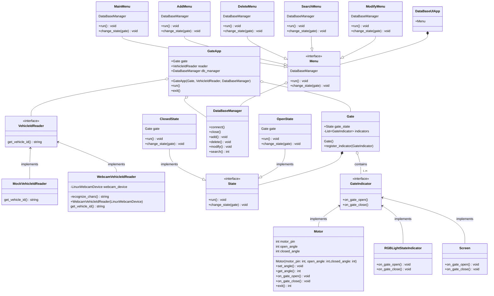
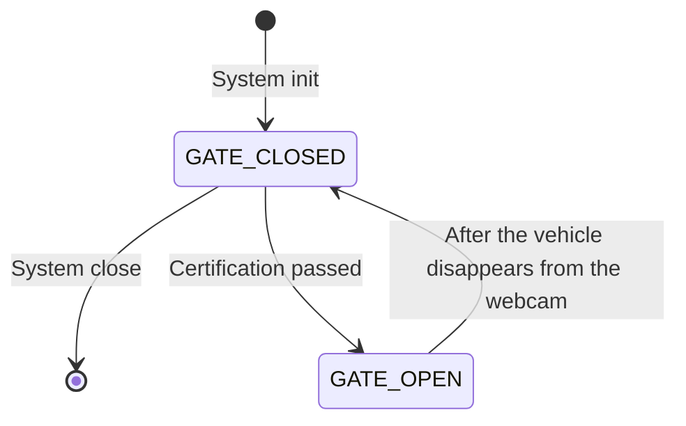
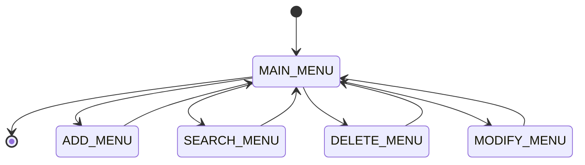

```mermaid
classDiagram

class GateApp{
    +Gate gate
    +VehicleIdReader reader
    +DataBaseManager db_manager
    +GateApp(Gate, VehicleIdReader, DataBaseManager)
    +run()
    +exit()
    
}

GateApp o-- Gate
GateApp o-- VehicleIdReader
GateApp o-- DataBaseManager

class VehicleIdReader{
    <<interface>>
    get_vehicle_id() string
}

class MockVehicleIdReader{
    get_vehicle_id() string
}

class WebcamVehicleIdReader{
    -LinuxWebcamDevice webcam_device
    -recognize_chars() string
    +WebcamVehicleIdReader(LinuxWebcamDevice)
    get_vehicle_id() string
}

VehicleIdReader <-- WebcamVehicleIdReader: implements
VehicleIdReader <-- MockVehicleIdReader: implements


class State{
    <<interface>>
    +run() void
    +change_state(gate) void
}


class ClosedState{
    Gate gate 
    +run() void
    +change_state(gate) void
}

class OpenState{
    Gate gate
    +run() void
    +change_state(gate) void
}

class Motor{
    int motor_pin
    int open_angle
    int closed_angle
    Motor(motor_pin: int, open_angle: int,closed_angle: int)
    +set_angle() void
    +get_angle() int
    +on_gate_open() void
    +on_gate_close() void
    <!--TODO: stateless or not-->
    +exit() int
    
}

class RGBLightStateIndicator{
    +on_gate_open() void
    +on_gate_close() void
}

class Screen{
    +on_gate_open() void
    +on_gate_close() void
}

class Gate{
    +State gate_state
    -List~GateIndicator~ indicators
    Gate()
    +register_indicator(GateIndicator)
}

class GateIndicator{
    <<interface>>
    +on_gate_open()
    +on_gate_close()
}

GateIndicator <-- Motor: implements
GateIndicator <-- RGBLightStateIndicator: implements
GateIndicator <-- Screen: implements
Gate o-- "1..m" GateIndicator: contains

class DataBaseManager{
    +connect()
    +close()
    +add() void
    +delete() void
    +modify() void
    +search() int
}


ClosedState --|> State: implements
OpenState --|> State: implements
Gate *-- State


class DataBaseUIApp{
    +Menu
}

Menu o-- DataBaseManager
class Menu{
    <<interface>>
    DataBaseManager
    +run() void
    +change_state(gate) void
}

class MainMenu{
    DataBaseManager
    +run() void
    +change_state(gate) void
}


class AddMenu{
    DataBaseManager
    +run() void
    +change_state(gate) void
}
class DeleteMenu{
    DataBaseManager
    +run() void
    +change_state(gate) void
}
class SearchMenu{
    DataBaseManager
    +run() void
    +change_state(gate) void
}

class ModifyMenu{
    DataBaseManager
    +run() void
    +change_state(gate) void
}

MainMenu --|> Menu
AddMenu --|> Menu
DeleteMenu --|> Menu
SearchMenu --|> Menu
ModifyMenu --|> Menu
DataBaseUIApp *-- Menu


```

```mermaid
stateDiagram

GATE_CLOSED
GATE_OPEN

[*] --> GATE_CLOSED: System init
GATE_CLOSED --> [*]: System close
GATE_CLOSED --> GATE_OPEN: Certification passed
GATE_OPEN --> GATE_CLOSED: After the vehicle disappears from the webcam


```

```mermaid
stateDiagram

MAIN_MENU
ADD_MENU 
SEARCH_MENU 
DELETE_MENU 
MODIFY_MENU 

[*] --> MAIN_MENU
MAIN_MENU --> [*]
MAIN_MENU --> ADD_MENU
MAIN_MENU --> SEARCH_MENU 
MAIN_MENU --> DELETE_MENU 
MAIN_MENU --> MODIFY_MENU
ADD_MENU    --> MAIN_MENU  
SEARCH_MENU --> MAIN_MENU   
DELETE_MENU --> MAIN_MENU   
MODIFY_MENU --> MAIN_MENU  

```