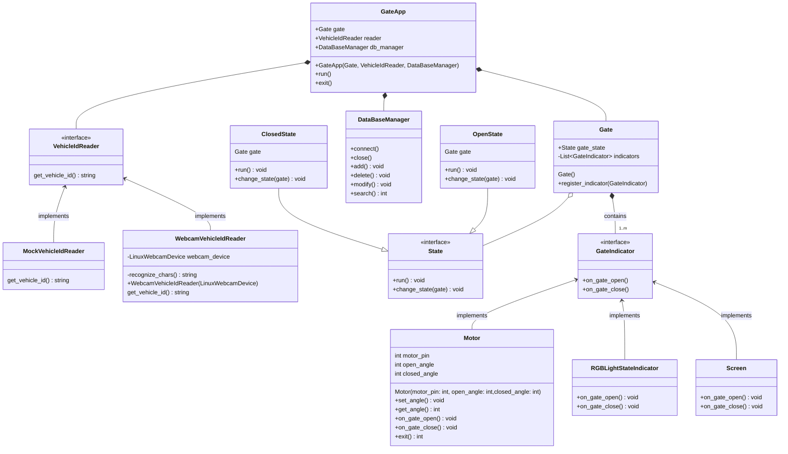
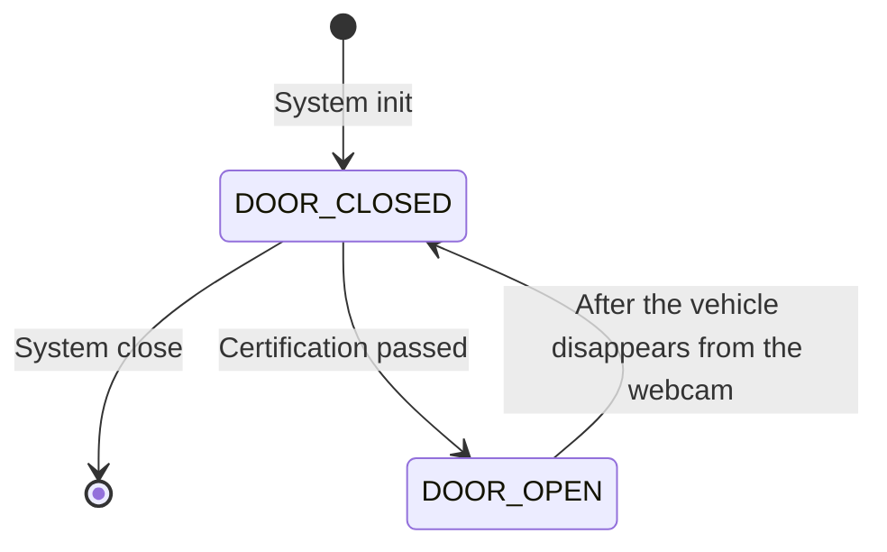

```mermaid
classDiagram

class GateApp{
    +Gate gate
    +VehicleIdReader reader
    +DataBaseManager db_manager
    +GateApp(Gate, VehicleIdReader, DataBaseManager)
    +run()
    +exit()
    
}

GateApp *-- Gate
GateApp *-- VehicleIdReader
GateApp *-- DataBaseManager

class VehicleIdReader{
    <<interface>>
    get_vehicle_id() string
}

class MockVehicleIdReader{
    get_vehicle_id() string
}

class WebcamVehicleIdReader{
    -LinuxWebcamDevice webcam_device
    -recognize_chars() string
    +WebcamVehicleIdReader(LinuxWebcamDevice)
    get_vehicle_id() string
}

VehicleIdReader <-- WebcamVehicleIdReader: implements
VehicleIdReader <-- MockVehicleIdReader: implements


class State{
    <<interface>>
    +run() void
    +change_state(gate) void
}


class ClosedState{
    Gate gate 
    +run() void
    +change_state(gate) void
}

class OpenState{
    Gate gate
    +run() void
    +change_state(gate) void
}

class Motor{
    int motor_pin
    int open_angle
    int closed_angle
    Motor(motor_pin: int, open_angle: int,closed_angle: int)
    +set_angle() void
    +get_angle() int
    +on_gate_open() void
    +on_gate_close() void
    <!--TODO: stateless or not-->
    +exit() int
    
}

class RGBLightStateIndicator{
    +on_gate_open() void
    +on_gate_close() void
}

class Screen{
    +on_gate_open() void
    +on_gate_close() void
}

class Gate{
    +State gate_state
    -List~GateIndicator~ indicators
    Gate()
    +register_indicator(GateIndicator)
}

class GateIndicator{
    <<interface>>
    +on_gate_open()
    +on_gate_close()
}

GateIndicator <-- Motor: implements
GateIndicator <-- RGBLightStateIndicator: implements
GateIndicator <-- Screen: implements
Gate *-- "1..m" GateIndicator: contains

class DataBaseManager{
    +connect()
    +close()
    +add() void
    +delete() void
    +modify() void
    +search() int
}


ClosedState --|> State
OpenState --|> State
Gate o-- State


```

```mermaid
stateDiagram

DOOR_CLOSED
DOOR_OPEN

[*] --> DOOR_CLOSED: System init
DOOR_CLOSED --> [*]: System close
DOOR_CLOSED --> DOOR_OPEN: Certification passed
DOOR_OPEN --> DOOR_CLOSED: After the vehicle disappears from the webcam


```

<!-- Gate *-- Motor
Gate *-- RGBController
Gate *-- ScreenController -->