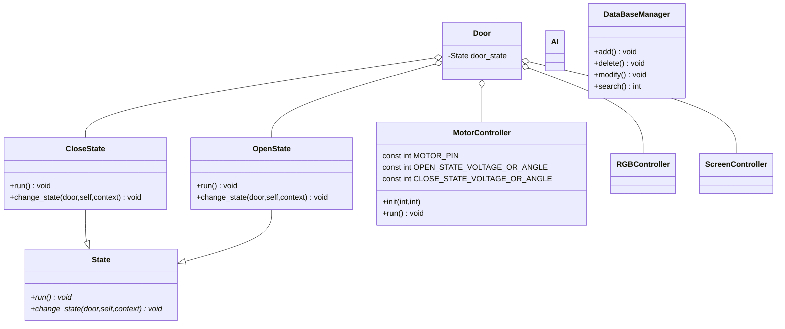
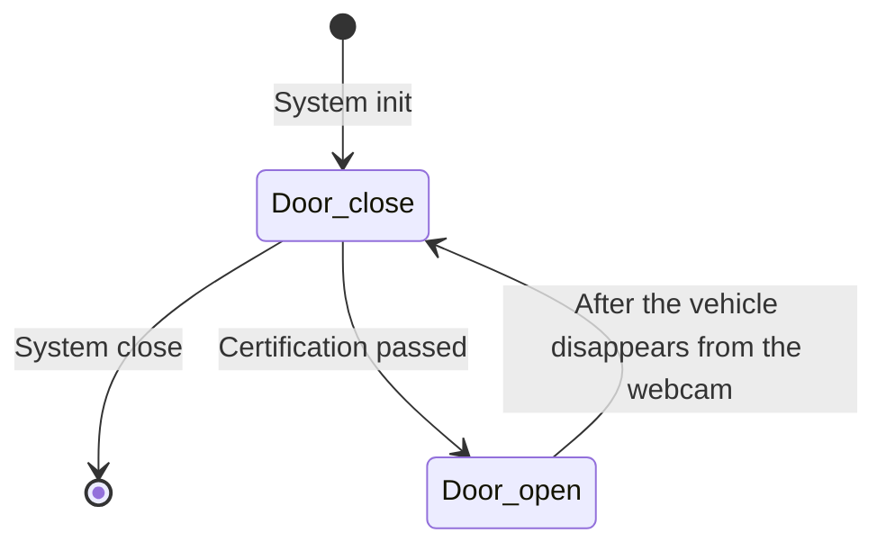

```mermaid
classDiagram

class State{
    +run() void*
    +change_state(door,self,context) void*

}

class CloseState{
    +run() void
    +change_state(door,self,context) void
}

class OpenState{
    +run() void
    +change_state(door,self,context) void
}

class MotorController{
    const int MOTOR_PIN
    const int OPEN_STATE_VOLTAGE_OR_ANGLE
    const int CLOSE_STATE_VOLTAGE_OR_ANGLE
    +init(int,int)
    +run() void
}

class RGBController

class ScreenController


class Door{
    -State door_state
}

class AI

class DataBaseManager{
    +add() void
    +delete() void
    +modify() void
    +search() int
}


CloseState --|> State
OpenState --|> State
Door o-- CloseState
Door o-- OpenState
Door o-- MotorController
Door o-- RGBController
Door o-- ScreenController


```

```mermaid
stateDiagram

Door_close
Door_open

[*] --> Door_close: System init
Door_close --> [*]: System close
Door_close --> Door_open: Certification passed
Door_open --> Door_close: After the vehicle disappears from the webcam


```